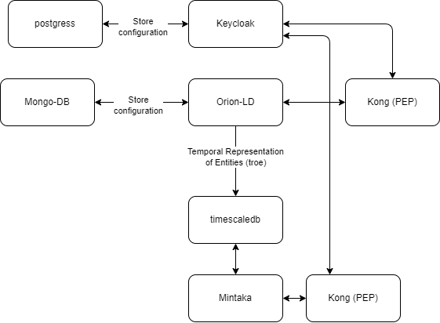

# RAMP IoT LD Platform
The RAMP IoT LD (Linked Data) Platform utilizes a FIWARE installation, designed to be implemented on factory premises and integrated with the RAMP marketplace. It compatible with the [NGSI-LD](https://www.etsi.org/deliver/etsi_gs/CIM/001_099/009/01.07.01_60/gs_cim009v010701p.pdf) (Next Generation Service Interfaces) specifications. This platform setup serves as a template, equipped with minimal configurations to facilitate a smooth startup. Utilizing [FIWARE generic enablers](https://github.com/FIWARE/catalogue), the RAMP IoT platform is established. 

## Architecture 
The main components of the RAMP IoT LD platform are:
1. [Orion-LD](https://github.com/FIWARE/context.Orion-LD) as Context Broker.
2. [Mintaka](https://github.com/FIWARE/mintaka) as NGSI-LD temporal retrieval API.
3. [Keycloak](https://www.keycloak.org/) as single sign-on with identity and access management.
4. [Kong](https://github.com/FIWARE/kong-plugins-fiware) as PEP (Policy Enforcement Point) proxy for Orion-LD and Mintaka.
5. [TimescaleDB](https://www.timescale.com/) to store all entities received by Orion-LD.
6. [Quantumleap](https://github.com/orchestracities/ngsi-timeseries-api) and [CrateDB](https://cratedb.com) for compatibility with older RAMP-IoT installation. Do not use for new installations.

The user can use a number of already developed [IoT Agents and Generic Enablers](https://github.com/FIWARE/catalogue#interface-with-iot-robots-and-third-party-systems) developed by FIWARE to provide data to the RAMP-IoT-LD platform.

# Demo
For demonstration prepusus a demo application has been implemented. See **[Demo.md](demo/Demo.md)**

## Prerequisite
RAMP IoT LD platform runs in Docker containers and hence Docker and Docker-Compose are required. Machine where IoT platform can be either virtual machine or real computer, but it needs to have sufficient resources. Environment requires these _minimum_ resources:
- 5GB RAM (Hard minum limit, more is better)
- 50GB Disk space (more as needed for the data that is being stored)
- 4 CPU's (less can work but results in performance loss)

Disk space for database
- 43Mb for a 70,000 rows (each different measurement has a unique row.ie sensor measure 4 variables for each timestamp, 4 rows will be added to the db + addidtional relactioshipes ).
See databaseTable_attributes.txt for more info

Copyright © 2023-2024 European Dynamics Luxembourg S.A.

Licensed under the EUPL, Version 1.2.
You may not use this work except in compliance with the License.
You may obtain a copy of the License at https://joinup.ec.europa.eu/collection/eupl/eupl-text-eupl-12 

Unless required by applicable law or agreed to in writing, software distributed under the License is distributed on an "AS IS" BASIS,
WITHOUT WARRANTIES OR CONDITIONS OF ANY KIND, either express or implied. See the License for the specific language governing permissions and limitations under the License.