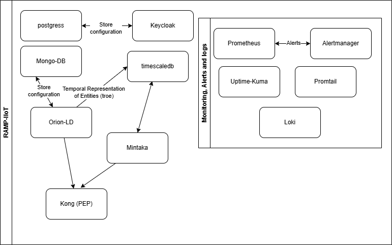

# RAMP IIoT LD Platform
The RAMP IIoT LD (Linked Data) Platform utilizes a FIWARE installation, designed to be implemented on factory premises and integrated with the RAMP marketplace. It compatible with the [NGSI-LD](https://www.etsi.org/deliver/etsi_gs/CIM/001_099/009/01.07.01_60/gs_cim009v010701p.pdf) (Next Generation Service Interfaces) specifications. This platform setup serves as a template, equipped with minimal configurations to facilitate a smooth startup. Utilizing [FIWARE generic enablers](https://github.com/FIWARE/catalogue), the RAMP IIoT platform is established. 

## Architecture 
The main components of the RAMP IIoT LD platform are:
1. [Orion-LD](https://github.com/FIWARE/context.Orion-LD) as Context Broker.
2. [Mintaka](https://github.com/FIWARE/mintaka) as NGSI-LD temporal retrieval API.
3. [Keycloak](https://www.keycloak.org/) as single sign-on with identity and access management.
4. [Kong](https://github.com/FIWARE/kong-plugins-fiware) as PEP (Policy Enforcement Point) proxy for Orion-LD and Mintaka.
5. [TimescaleDB](https://www.timescale.com/) to store all entities received by Orion-LD.



The user can use a number of already developed [IoT Agents and Generic Enablers](https://github.com/FIWARE/catalogue#interface-with-iot-robots-and-third-party-systems) developed by FIWARE to provide data to the RAMP-IoT-LD platform.

# Demo
For demonstration prepusus a demo application has been implemented. See **[Demo.md](demo/Demo.md)**

## Prerequisite
RAMP IIoT LD platform runs in Docker containers and hence Docker and Docker-Compose are required. Machine where IoT platform can be either virtual machine or real computer, but it needs to have sufficient resources. Environment requires these _minimum_ resources:
- 5GB RAM (Hard minum limit, more is better)
- 50GB Disk space (more as needed for the data that is being stored)
- 4 CPU's (less can work but results in performance loss)

Disk space for database
- 43Mb for a 70,000 rows (each different measurement has a unique row.ie sensor measure 4 variables for each timestamp, 4 rows will be added to the db + addidtional relactioshipes ).
See databaseTable_attributes.txt for more info


# Integration testing

An integration testing have been developed with the pytest. The integration testing includes the Orion-LD, TROE-Mintaka and Kong. Also the multi tenant functionality of Orion is tested. The required packages are included into the ```integration_testing/requirements.txt```
To run the integration testing, the system needs to be up and running.
1. ```./service start```
2. ```cd integration_testing```
3. ```pytest -vvv```


# Monitoring


## Uptime Kuma

[Uptime Kuma](https://github.com/louislam/uptime-kuma) is a self-hosted monitoring tool (similar to UptimeRobot) that provides a dashboard to track the availability of all platform services.

### Services Monitored

| Service | Check Type | Endpoint |
|---|---|---|
| Orion-LD Context Broker | HTTP | `http://ramp_iiot-orion:1026/version` |
| Mintaka Temporal API | HTTP | `http://ramp_iiot-mintaka:8086/info` |
| MongoDB | TCP Port | `ramp_iiot-mongo-db:27017` |
| TimescaleDB | TCP Port | `ramp_iiot-timescale-db:5432` |
| Keycloak IAM | HTTP | `http://keycloak:8080/health/ready` |
| Kong API Gateway | TCP Port | `kong:443` |
| IoT Agent MQTT | HTTP | `http://iot-agent-mqtt:4042/iot/about` |
| Mosquitto MQTT Broker | TCP Port | `mosquitto:1883` |
| Prometheus | HTTP | `http://prometheus:9090/-/healthy` |
| Alertmanager | HTTP | `http://prometheus-alertmanager:9093/-/healthy` |
| LD Context Server | HTTP | `http://ramp_iiot-ld-context/merge_data_model.jsonld` |

### Setup

1. Enable monitoring in `docker-compose.yml` by uncommenting `- monitoring.yml` from the `include` section.

2. Start the stack:
   ```bash
   ./service.sh start
   ```

3. Install the Python dependency and run the setup script to auto-configure all monitors:
   ```bash
   pip install uptime-kuma-api
   cd monitoring
   ./setup_uptime_kuma.sh
   ```

4. Access the dashboard at **http://localhost:3001**. Default credentials are configured via the `.env` file:
   - `UPTIME_KUMA_USER` (default: `admin`)
   - `UPTIME_KUMA_PASSWORD` (default: `Pa55w0rd!`)

### Configuration

The Uptime Kuma service is defined in `monitoring.yml` and persists its data in the `uptime-kuma-data` Docker volume. It runs on port `3001` (configurable via `UPTIME_KUMA_PORT` in `.env`) and is bound to `127.0.0.1` (localhost only).

The setup script (`monitoring/setup_uptime_kuma.sh`) is idempotent — running it again will skip monitors that already exist. To reconfigure, delete existing monitors from the Uptime Kuma UI and re-run the script.

## Prometheus Alerts
### Seting up the Prometheus alerts

Navigate to the IP:9090/graph and add a graph with the following query
```
rate(ngsildRequests[10m]) 
```
Set a values to the alert to be a little less than the normal trafic 


### Loki (Log Aggregation)

[Loki](https://grafana.com/oss/loki/) collects and indexes logs from all Docker containers. [Promtail](https://grafana.com/docs/loki/latest/send-data/promtail/) is deployed alongside to automatically discover containers and ship their logs to Loki.

Loki and Promtail are included in `monitoring.yml` — no manual volume permission setup is required.

### Querying Logs

Loki exposes its API on `http://localhost:3100`. You can query logs directly:

```bash
# Logs from the Orion-LD container (last hour)
curl -s 'http://localhost:3100/loki/api/v1/query_range' \
  --data-urlencode 'query={container="ramp_iiot-orion"}' | python3 -m json.tool

# Filter by service name
curl -s 'http://localhost:3100/loki/api/v1/query_range' \
  --data-urlencode 'query={service="ramp_iiot-orion"} |= "ERROR"' | python3 -m json.tool
```

To get a full dashboard, connect [Grafana](https://grafana.com/) and add Loki (`http://loki:3100`) as a data source.

# Backup

## TimescaleDB Backup

The script `backup_timescale/backup_timescale_db.sh` creates a full backup of **all databases** in the TimescaleDB PostgreSQL cluster, including roles and tablespaces.

### Prerequisites

- The TimescaleDB container (`ramp_iiot-timescale-db`) must be running.
- Database credentials must be set in `.env.secrets` (requires `ORIONLD_TROE_USER`).

### Usage

```bash
cd backup_timescale
./backup_timescale_db.sh
```

The script will:
1. Verify the TimescaleDB container is running.
2. List all databases in the cluster.
3. Run `pg_dumpall` with progress indication showing the current database and file size.
4. Compress the output with `gzip`.

Backups are saved to the `backup_timescale/` directory as `ramp_iiot_timescaledb_ALL_backup_<TIMESTAMP>.sql.gz`.

### Restore

```bash
# Standard restore
gunzip -c backup_timescale/ramp_iiot_timescaledb_ALL_backup_<TIMESTAMP>.sql.gz \
  | docker exec -i ramp_iiot-timescale-db psql -U <DB_USER> -d postgres

# If constraint issues occur during restore
gunzip -c backup_timescale/ramp_iiot_timescaledb_ALL_backup_<TIMESTAMP>.sql.gz \
  | docker exec -i ramp_iiot-timescale-db psql -U <DB_USER> -d postgres -v ON_ERROR_STOP=0
```

### Retention (Optional)

To automatically keep only the last N backups, uncomment the `KEEP_BACKUPS` section in the script and adjust the number.


----------

Copyright © 2023-2024 European Dynamics Luxembourg S.A.

Licensed under the EUPL, Version 1.2.
You may not use this work except in compliance with the License.
You may obtain a copy of the License at https://joinup.ec.europa.eu/collection/eupl/eupl-text-eupl-12 


Unless required by applicable law or agreed to in writing, software distributed under the License is distributed on an "AS IS" BASIS,
WITHOUT WARRANTIES OR CONDITIONS OF ANY KIND, either express or implied. See the License for the specific language governing permissions and limitations under the License.