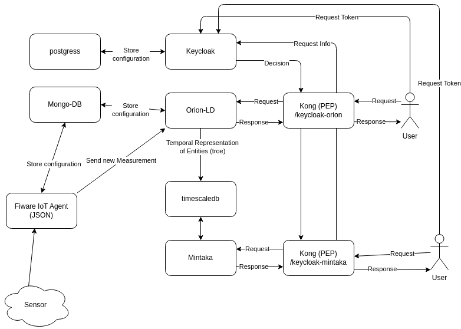

# Demo RAMP-IoT-LD

A demo have been prepared for the user to familiarize with the different components.
The main components are:
1. [Orion-LD](https://github.com/FIWARE/context.Orion-LD) as Context Broker. Listen to port 1026.
2. [Mintaka](https://github.com/FIWARE/mintaka) as NGSI-LD temporal retrieval API. Listen to port 8089.
3. [Keycloak](https://www.keycloak.org/) as single sign-on with identity and access management. Listen to 8443. Self-singed certificaties with admin:Pa55w0rd.
4. [Kong](https://github.com/FIWARE/kong-plugins-fiware) as PEP (Policy Enforcement Point) proxy for Orion-LD and Mintaka. Listen to port 443. See [kong.yaml](../kong-config/kong.yaml) for more details about the implementation.
5. [TimescaleDB](https://www.timescale.com/) to store all entities received by Orion-LD.
6. [FIWARE IoT JSON Agent](https://github.com/telefonicaid/iotagent-json) to provide measurements .



The demo have can run on every Linux system. The following tools needs to be installed: ```docker-compose, curl, bash, jq``` 
jq is used for the formatting of the return json from Orion-LD and Mintaka.

## Docker
To run RAMP-IoT use: ```./service start``` on the main folder. The first time will need to download all Docker images ~10minutes depending on internet speed. Then open another terminal to [continue](#demo).

The main docker-compose file(docker-compose.yml) include additional compose files for specific services.
1. temporal.yml. Service for Mintaka and TimescaleDB.
2. keycloak.yml. Service for Keycloak and Kong.
3. iot-agent-json.yml. Service for IoT Agent.

**IMPORTANT** The database of Keycloak (volume ramp-keycloak-db) have been initialised with default values for the purposes of the demo. To disable it comment line " - ${PWD}/keycloak/create_tables.sql:/docker-entrypoint-initdb.d/create_tables.sql" on the [keycloak.yml](../keycloak.yml), remove the image (```docker volume rm ramp_iiot_ramp-keycloak-db```), restart docker-compose and follow the instruction [here](#keyclock) for setup.

## Demo with IoT Agent - JSON
A demo script has been developed. See [demo_data](./demo_data/) for more details.
run: ```./setup_demo.sh```, to create a Particular Mater sensor (ID urn:urn:ngsi-ld:ENERGY_METER:energymeter-001) and add 10 random measurements.
See [tutorials.IoT-Agent-JSON](https://github.com/FIWARE/tutorials.IoT-Agent-JSON/tree/NGSI-LD) to familiarize with the use of Orion-LD and IoT JSON Agent.
An instance of particular mater sensor is created on the Fiware IoT Agent JSON and the senor data are feed by a POST method (see [demo_data/generate_measurements_pm_sensor.sh](demo_data/generate_measurements_pm_sensor.sh)) to the corresponding end point.


TODO add some info about tenants


### Query Orion-LD to get the last values  
IOTA agent EOL -> all JSON
You can use the following commands:
1. ```./getOrionVersion.sh``` : To get the version of the Orion-LD
2. ```./getOrionVersionViaKong.sh``` : To get the version of the Orion-LD using KONG as PEP (Policy Enforcement Point) proxy
3. ```./getDataSensors.sh openiot PM_SENSOR``` : To get the last measurement of the pm_sensor-001 (The sensors was created with the setup_demo.sh script)
4. ```./getDataSensorsViaKong.sh openiot PM_SENSOR``` : To get the last measurement of the pm_sensor-001 using KONG as PEP (Policy Enforcement Point) proxy
TODO add the for one sensor

### Query Mintaka to get access to the temporal NGSI-LD interface 
1. ```./getMintakaInfo.sh``` : To get the version of the Mintaka
2. ```./getMintakaInfoViaKong.sh``` : To get the version of the Mintaka using KONG as PEP (Policy Enforcement Point) proxy
3. ```./getMintakaSensor.sh openiot urn:ngsi-ld:PM_SENSOR:pm_sensor-001``` : To get the latest 5 measurements of the pm_sensor-001 (The sensors was created with the setup_demo.sh script)
4. ```./getMintakaSensorViaKong.sh openiot urn:ngsi-ld:PM_SENSOR:pm_sensor-001``` : To get the 5 latest measurements of the pm_sensor-001 using KONG as PEP (Policy Enforcement Point) proxy

When a program with the word "Token" is run, it request the token from the local Keycloak server and supply it with the request to the Kong proxy. See 'getTOrionoken.sh', 'getTokenMintaka.sh' are run to request the token from the Keycloak and they save the received token on the 'token.txt' and 'tokenMintaka.txt'.  

## Demo with IoT Agent - MQTT
**IMPORTANT** Enable the corresponding variable in the service.sh file (change the configuration to activate the Docker with IoT MQTT Agent (comment L17 and uncomment L19)) and install the [mosquitto_pub](https://mosquitto.org/download/).

A demo script has been developed. See [demo_data_mqtt](./demo_data_mqtt/) for more details.
run: ```./setup_demo_mqtt.sh```, to create a Energy meter sensor (ID urn:ngsi-ld:PM_SENSOR:pm_sensor-001) and add 10 random measurements.
See [tutorials.IoT-over-MQTT](https://github.com/FIWARE/tutorials.IoT-over-MQTT/tree/NGSI-LD) to familiarize with the use of Orion-LD and IoT JSON Agent.
An instance of energy sensor is created on the Fiware IoT Agent MQTT and the senor data are feed by a POST method (see [demo_data/generate_measurements_energy_meter.sh](demo_data/generate_measurements_energy_meter.sh)) to the corresponding end point.

### Query Orion-LD to get the last values  
You can use the following commands:
1. ```./getOrionVersion.sh``` : To get the version of the Orion-LD
2. ```./getOrionVersionViaKong.sh``` : To get the version of the Orion-LD using KONG as PEP (Policy Enforcement Point) proxy
3. ```./getDataSensors.sh ENERGY_METER``` : To get the last measurement of the pm_sensor-001 (The sensors was created with the setup_demo.sh script)
4. ```./getDataSensorsViaKong.sh ENERGY_METER``` : To get the last measurement of the pm_sensor-001 using KONG as PEP (Policy Enforcement Point) proxy

### Query Mintaka to get access to the temporal NGSI-LD interface 
1. ```./getMintakaInfo.sh``` : To get the version of the Mintaka
2. ```./getMintakaInfoViaKong.sh``` : To get the version of the Mintaka using KONG as PEP (Policy Enforcement Point) proxy
3. ```./getMintakaSensor.sh openiot_mqtt urn:ngsi-ld:ENERGY_METER:energymeter-001``` : To get the latest 5 measurements of the pm_sensor-001 (The sensors was created with the setup_demo.sh script)
4. ```./getMintakaSensorViaKong.sh openiot_mqtt urn:ngsi-ld:ENERGY_METER:energymeter-001``` : To get the 5 latest measurements of the pm_sensor-001 using KONG as PEP (Policy Enforcement Point) proxy


TODO replicate the interaction with POSTMAN

## Keyclock, create new realm
**The following procedure is NOT required to run the demo. The following step NEEDS TO BE PERFORMED when you need to run ANYTHING else except the current demo.**    

Update the following variables **AT THE MINIMUM** into to '.env.secrets' file.
- KEYCLOAK_DB_USER
- KEYCLOAK_DB_PASSWORD
- KEYCLOAK_USER
- KEYCLOAK_PASSWORD

Follow the instruction to create a new Realm on Keyclock. When run for the fist time, go to https://localhost:8443 with the following credentials admin:Pa55w0rd (.env-> KEYCLOAK_USER:KEYCLOAK_PASSWORD).

Go to left menu, on the top, click on master then click on "add" and load the file "keycloak/keycloack-fiware-serviceWithMintaka.json" under keycloak folder.
Add a user, Users with the following credentials admin-user:admin-user, Groups: admin, consumer. PLEASE USE custom user credentials for your own installation. 

### Setup orion-pep client
- Go to Clients->orion-pep->Credentials-> Regenerate. Copy/paste key to client_secret in the 'getTOrionoken.sh' file. Also update the username, password with your custom credential created before
- Go to kong-config/kong.yaml: search for "keycloakclientsecret" in the service "orion-keycloak" and paste the key.
Update the  
### Setup mintaka-pep client
- Go to Clients->mintaka-pep->Credentials-> Regenerate. Copy/paste key to client_secret in the 'getTokenMintaka.sh' file. Also update the username, password with your custom credential created before
- Go to kong-config/kong.yaml: search for "keycloakclientsecret" in the service "mintaka-keycloak" and paste the key 

**Then restart docker!**


Now rerun all the commands containing keyword 'Token' to verify the configuration is correct. if the following error appears when you run any of the commands 'parse error: Invalid numeric literal at line 1, column 9', open the file of the command and remove from the end the '|jq', rerun the command to get the actual error. jq is used for the formatting of the return json from Orion-LD and Mintaka.


