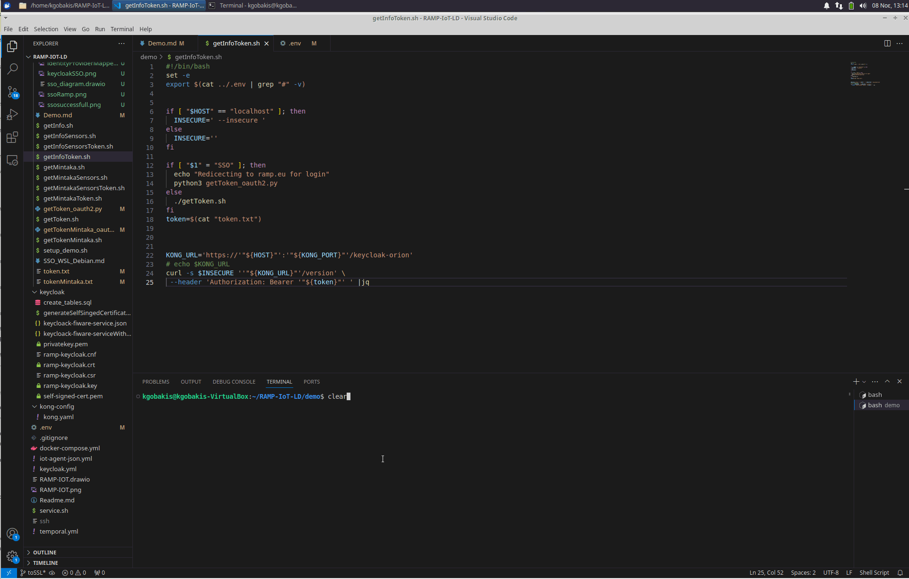

# Demo RAMP-IoT-LD

A demo have been prepared for the user to familiarize with the different components.
The main components are:
1. [Orion-LD](https://github.com/FIWARE/context.Orion-LD) as Context Broker. Listen to port 1026.
2. [Mintaka](https://github.com/FIWARE/mintaka) as NGSI-LD temporal retrieval API. Listen to port 8089.
3. [Keycloak](https://www.keycloak.org/) as single sign-on with identity and access management. Listen to 8443. Self-singed certificaties with admin:Pa55w0rd.
4. [Kong](https://github.com/FIWARE/kong-plugins-fiware) as PEP (Policy Enforcement Point) proxy for Orion-LD and Mintaka. Listen to port 443. See [kong.yaml](../kong-config/kong.yaml) for more details about the implementation.
5. [TimescaleDB](https://www.timescale.com/) to store all entities received by Orion-LD.
6. [FIWARE IoT JSON Agent](https://github.com/telefonicaid/iotagent-json) to provide measurements .


The demo have can run on every Linux system. The following tools needs to be installed: ```docker-compose, curl, bash, jq``` 
jq is used for the formatting of the return json from Orion-LD and Mintaka.

## Docker
To run RAMP-IoT use: ```./service start``` on the main folder. The first time will need to download all Docker images ~10minutes depending on internet speed. Then open another terminal to [continue](#demo).

The main docker-compose file(docker-compose.yml) include additional compose files for specific services.
1. temporal.yml. Service for Mintaka and TimescaleDB.
2. keycloak.yml. Service for Keycloak and Kong.
3. iot-agent-json.yml. Service for IoT Agent.

**IMPORTANT** The database of Keycloak (volume ramp-keycloak-db) have been initialised with default values for the purposes of the demo. To disable it comment line " - ${PWD}/keycloak/create_tables.sql:/docker-entrypoint-initdb.d/create_tables.sql" on the [keycloak.yml](../keycloak.yml), remove the image (```docker volume rm ramp_iiot_ramp-keycloak-db```), restart docker-compose and follow the instruction [here](#keyclock) for setup.

## Demo with IoT Agent - JSON
A demo script has been developed. See [demo_data](./demo_data/) for more details.
run: ```./setup_demo.sh```, to create a Particular Mater sensor (ID urn:urn:ngsi-ld:ENERGY_METER:energymeter-001) and add 10 random measurements.
See [tutorials.IoT-Agent-JSON](https://github.com/FIWARE/tutorials.IoT-Agent-JSON/tree/NGSI-LD) to familiarize with the use of Orion-LD and IoT JSON Agent.
An instance of particular mater sensor is created on the Fiware IoT Agent JSON and the senor data are feed by a POST method (see [demo_data/generate_measurements_pm_sensor.sh](demo_data/generate_measurements_pm_sensor.sh)) to the corresponding end point.

### Query Orion-LD to get the last values  
You can use the following commands:
1. ```./getInfo.sh``` : To get the version of the Orion-LD
2. ```./getInfoToken.sh``` : To get the version of the Orion-LD using KONG as PEP (Policy Enforcement Point) proxy
3. ```./getInfoSensors.sh``` : To get the last measurement of the pm_sensor-001 (The sensors was created with the setup_demo.sh script)
4. ```./getInfoSensorsToken.sh``` : To get the last measurement of the pm_sensor-001 using KONG as PEP (Policy Enforcement Point) proxy
### Query Mintaka to get access to the temporal NGSI-LD interface 
1. ```./getMintaka.sh``` : To get the version of the Mintaka
2. ```./getMintakaToken.sh``` : To get the version of the Mintaka using KONG as PEP (Policy Enforcement Point) proxy
3. ```./getMintakaSensors.sh``` : To get the latest 5 measurements of the pm_sensor-001 (The sensors was created with the setup_demo.sh script)
4. ```./getMintakaSensorsToken.sh``` : To get the 5 latest measurements of the pm_sensor-001 using KONG as PEP (Policy Enforcement Point) proxy

When a program with the word "Token" is run, it request the token from the local Keycloak server and supply it with the request to the Kong proxy. See 'getToken.sh', 'getTokenMintaka.sh' are run to request the token from the Keycloak and they save the received token on the 'token.txt' and 'tokenMintaka.txt'.  

## Demo with IoT Agent - MQTT
**IMPORTANT** Enable the corresponding variable in the service.sh file (change the configuration to activate the Docker with IoT MQTT Agent (comment L17 and uncomment L19)) and install the [mosquitto_pub](https://mosquitto.org/download/).

A demo script has been developed. See [demo_data_mqtt](./demo_data_mqtt/) for more details.
run: ```./setup_demo_mqtt.sh```, to create a Energy meter sensor (ID urn:ngsi-ld:PM_SENSOR:pm_sensor-001) and add 10 random measurements.
See [tutorials.IoT-over-MQTT](https://github.com/FIWARE/tutorials.IoT-over-MQTT/tree/NGSI-LD) to familiarize with the use of Orion-LD and IoT JSON Agent.
An instance of energy sensor is created on the Fiware IoT Agent MQTT and the senor data are feed by a POST method (see [demo_data/generate_measurements_energy_meter.sh](demo_data/generate_measurements_energy_meter.sh)) to the corresponding end point.

### Query Orion-LD to get the last values  
You can use the following commands:
1. ```./getInfo.sh``` : To get the version of the Orion-LD
2. ```./getInfoToken.sh``` : To get the version of the Orion-LD using KONG as PEP (Policy Enforcement Point) proxy
3. ```./getInfoSensors.sh ENERGY_METER``` : To get the last measurement of the pm_sensor-001 (The sensors was created with the setup_demo.sh script)
4. ```./getInfoSensorsToken.sh ENERGY_METER``` : To get the last measurement of the pm_sensor-001 using KONG as PEP (Policy Enforcement Point) proxy
### Query Mintaka to get access to the temporal NGSI-LD interface 
1. ```./getMintaka.sh``` : To get the version of the Mintaka
2. ```./getMintakaToken.sh``` : To get the version of the Mintaka using KONG as PEP (Policy Enforcement Point) proxy
3. ```./getMintakaSensors.sh urn:ngsi-ld:ENERGY_METER:energymeter-001``` : To get the latest 5 measurements of the pm_sensor-001 (The sensors was created with the setup_demo.sh script)
4. ```./getMintakaSensorsToken.sh urn:ngsi-ld:ENERGY_METER:energymeter-001``` : To get the 5 latest measurements of the pm_sensor-001 using KONG as PEP (Policy Enforcement Point) proxy

### Quantumleap and CrateDB
If the [QuantumLeap API](https://app.swaggerhub.com/apis/smartsdk/ngsi-tsdb/0.8.3) is needed you can add the quantumleap.yml to the "./service" file.
You need to subscribe for each sensor type or sensor ID. YOu can use the ```./subscribeQuantumLeap_PM_SENSOR.sh``` to subscribe to any measurements from PM_SENSOR. The data are saved on the CrateDB (localhost:4200) to access the web-interface

## Keyclock, create new realm
**The following procedure is NOT required to run the demo. The following step NEEDS TO BE PERFORMED when you need to run ANYTHING else except the current demo.**    

Update the following variables **AT THE MINIMUM** into to '.env.secrets' file.
- KEYCLOAK_DB_USER
- KEYCLOAK_DB_PASSWORD
- KEYCLOAK_USER
- KEYCLOAK_PASSWORD

Follow the instruction to create a new Realm on Keyclock. When run for the fist time, go to https://localhost:8443 with the following credentials admin:Pa55w0rd (.env-> KEYCLOAK_USER:KEYCLOAK_PASSWORD).

Go to left menu, on the top, click on master then click on "add" and load the file "keycloak/keycloack-fiware-serviceWithMintaka.json" under keycloak folder.
Add a user, Users with the following credentials admin-user:admin-user, Groups: admin, consumer. PLEASE USE custom user credentials for your own installation. 

### Setup orion-pep client
- Go to Clients->orion-pep->Credentials-> Regenerate. Copy/paste key to client_secret in the 'getToken.sh' file. Also update the username, password with your custom credential created before
- Go to kong-config/kong.yaml: search for "keycloakclientsecret" in the service "orion-keycloak" and paste the key.
Update the  
### Setup mintaka-pep client
- Go to Clients->mintaka-pep->Credentials-> Regenerate. Copy/paste key to client_secret in the 'getTokenMintaka.sh' file. Also update the username, password with your custom credential created before
- Go to kong-config/kong.yaml: search for "keycloakclientsecret" in the service "mintaka-keycloak" and paste the key 

**Then restart docker!**


Now rerun all the commands containing keyword 'Token' to verify the configuration is correct. if the following error appears when you run any of the commands 'parse error: Invalid numeric literal at line 1, column 9', open the file of the command and remove from the end the '|jq', rerun the command to get the actual error. jq is used for the formatting of the return json from Orion-LD and Mintaka.

## SSO from Ramp.eu keycloak

With these option, any user that have been register to the [ramp.eu](https://ramp.eu/). The first step is to setup the SSO (Single sign on) between your Keycloak and Ramp.eu. Use the [ContactUs](https://ramp.eu/#/contactus) to revieve the Client ID and secret. Then:


### Set up SSO
1. Go to keycloak admin interface and log in as admin. 
2. Navigate the realm with the fiware configuration (ie fiware-server). 
2. Select 'Identity providers' -> 'Add provider' -> 'Keycloak OpenID connect'
3. Set: 
    - Alias (Do not use spaces in the name) ie loginwithramp
    - Change the display name to 'Login with RAMP'
    - On Discovery endpoint enter: "https://ramp.eu/auth/realms/ramp/.well-known/openid-configuration"
    - 'Client authentication' -> select 'Client secret sent as post'
    - Enter client ID, Client Secret recieved from ramp team.
    - Save
4. Go to the created Identity provider (loginwithramp) -> Mapper -> Add mapper and set:
    - Name 
    - 'Sync mode override' -> Force
    - Mapper type -> Advanced Claim to Group
    - Claims-> Key: email, Value: ".*"
    - Enable Regex claims Values
    - Group-> select consumer
<!--  -->
 5. Go to both clients that you need to authenticate (ie orion-pep, mintaka-pep) and add 'http://localhost:8080/*' to Valid redirect URIs
 6. Go to 'getToken_oauth2.py' and 'getTokenMintaka_oauth2.py' and replace the localKeycloakServer, keycloakClient, keycloakClientSecret variables.
 7. Make your Keycloak available to the internet. Edit 'keycloak.yml' configuration on ports. Especially, disable access to port 8080 !!! 
 
  
### Query Orion-LD to get the last values with SSO 

python3 and the package 'oauth2_client' (pip install oauth2-client) needs to be installed in your environment. During the process of running any of the following commands, a URL needs to be opened on your browser to be authenticated on the ramp.eu. You need to update the localKeycloakServer, keycloakClient, keycloakClientSecret in both 'getToken_oauth2.py' and 'getTokenMintaka_oauth2.py' files to point to your Keycloak. IMPORTANT Keycloak url need to be a fully qualified domain name (FQDN).
When you use the SSO as command line argument the following scripts will execute 'getToken_oauth2.py' or 'getTokenMintaka_oauth2.py' instead of the 'getToken.sh' and 'getTokenMintaka.sh'.

**Important the local Auth2 client will accept connection on 8080. Please have the port 8080 free** 


You can use the following commands:
1. ```./getInfoToken.sh SSO``` : To get the version of the Orion-LD using KONG as PEP (Policy Enforcement Point) proxy and credentials from ramp.eu
2. ```./getInfoSensorsToken.sh SSO``` : To get the last measurement of the pm_sensor-001 using KONG as PEP (Policy Enforcement Point) proxy and credentials from ramp.eu
### Query Mintaka to get access to the temporal NGSI-LD interface  with SSO 
1. ```./getMintakaToken.sh SSO``` : To get the version of the Mintaka using KONG as PEP (Policy Enforcement Point) proxy and credentials from ramp.eu
2. ```./getMintakaSensorsToken.sh SSO``` : To get the 5 latest measurements of the pm_sensor-001 using KONG as PEP (Policy Enforcement Point) proxy and credentials from ramp.eu




