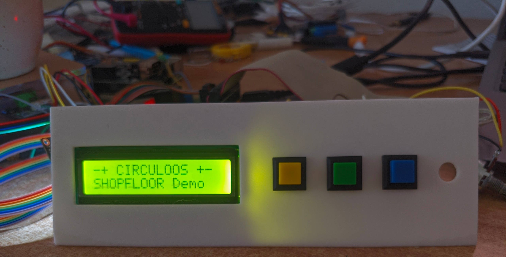
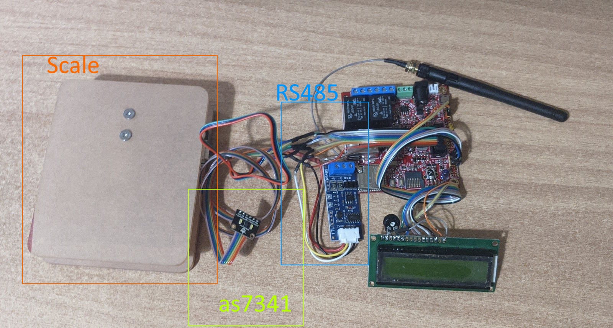
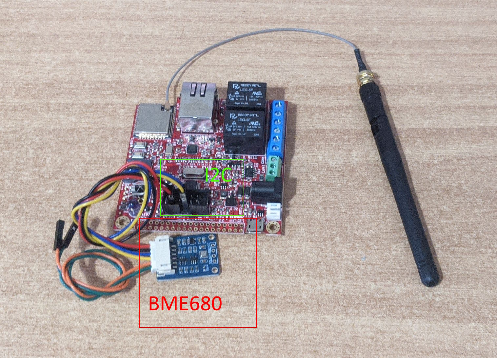
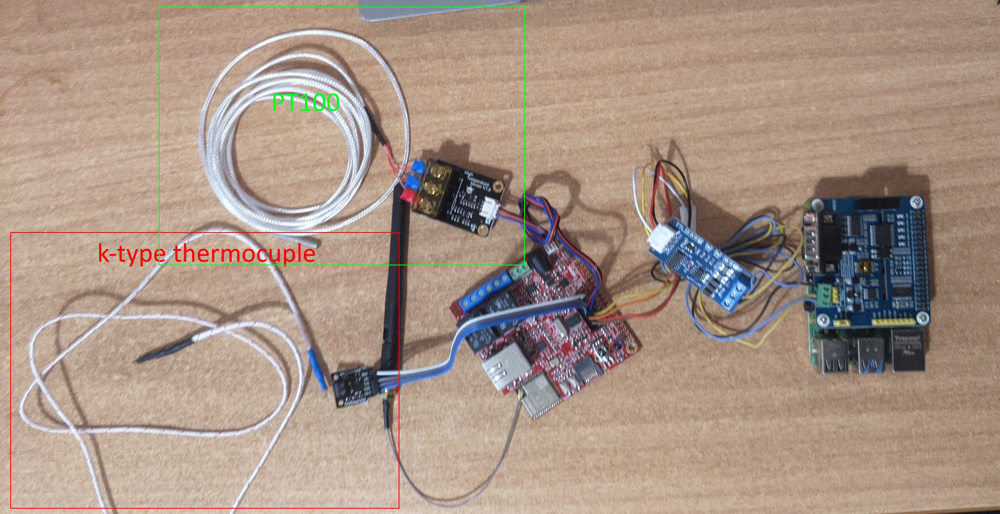

# Shopfloor Demonstration

## Overview
This document provides a comprehensive guide to the shopfloor demonstration, outlining the system architecture, setup instructions, and troubleshooting tips. The demonstration showcases the integration of various components within the RAMP-IIOT-LD-ED project for industrial IoT applications.

## Table of Contents
1. [Overview](#overview)
2. [Prerequisites](#prerequisites)
3. [Measurements](#measurements)
4. [Shopfloor Communication Protocols](#shopfloor-communication-protocols)
5. [Sensor Nodes](#sensor-nodes)
6. [System Architecture](#system-architecture)
7. [Demos](#demos)
8. [Troubleshooting](#troubleshooting)
9. [Support](#support)

## Prerequisites
- Docker and Docker Compose installed
- Access to the RAMP-IIOT-LD-ED repository
- Required hardware (e.g., sensors, Raspberry Pi, etc.)
- Network connectivity

## Measurements
The following measurements (from various sensors) are included:
- Air temperature (BME680)
- Air humidity (BME680)
- Air pressure (BME680)
- Surface temperature (Pt100, k-type thermocouple)
- Inductive proximity sensor
- Weight
- Colour

## Shopfloor Communication Protocols
The following communication protocols are included:
- CAN
- RS485
- MQTT
- I2C

## Sensor Nodes
The base embedded computational unit for each node is the ESP32 module by Olimex.

A list of the different nodes with each sensor can be found in [system.md](./system.md).

## System Architecture
The shopfloor demonstration consists of multiple components, including:
- IoT devices (sensors, nodes)
- Data processing services
- Monitoring and visualization tools

Refer to the following diagram for an overview:

# RASPBERRY PI
If you are utilizing RASPBERRY PI pi for hosting the RAMP-IIOT-LD please see the guide for installing the needed software [Guide](./rasbery_pi/rasbery_pi.md)
We utilize an emulator to run the existing images, QEMU.

## Demos
# Demos

### sensor_node_1_scale_and_colour_over_RS485

This sensor node (ESP32) simulates a station that measures the weight and identifies the color of an item. It consists of an LCD, two buttons, a scale, and color sensors.

**Workflow:**
1. Press a button to activate the color sensor and position it over the material to be identified.
2. The detected color is displayed on the LCD. Release the button to finalize.
3. Place the material (up to 1 kg) on the scale. Wait for the measurement to stabilize, then gently press the button.
4. Data is sent via RS-485 to the Raspberry Pi. A Python script reads the data from the serial port and transforms it into an NGSI-LD entity, making it available on the local RAMP-IIOT data platform.

### sensor_node_2_environmental_over_wifi

This node (ESP32) reads the external BME680 sensor via I2C every 10 minutes, transforms the measurements into JSON, and sends it to a local MQTT Broker running on the Raspberry Pi. The JSON message is read by the IoTAgent and becomes available to the local RAMP-IIOT data platform.

### sensor_node_3_temperature_over_can

This node (ESP32) reads the external Pt100 and a K-type thermocouple every 10 minutes and sends the measurements via CAN bus to the Raspberry Pi. A Python script reads the data from the serial port and transforms it into an NGSI-LD entity, making it available on the local RAMP-IIOT data platform.

## Troubleshooting
See [Troubleshoot.md](./Troubleshoot.md) for common problems and solutions.

## Support
For further assistance, please contact the project maintainers or open an issue in the repository.

---

© 2026 RAMP-IIOT-LD-ED Project. All rights reserved.

Licensed under the EUPL, Version 1.2. You may not use this work except in compliance with the License. You may obtain a copy of the License at [https://joinup.ec.europa.eu/collection/eupl/eupl-text-eupl-12](https://joinup.ec.europa.eu/collection/eupl/eupl-text-eupl-12).

Unless required by applicable law or agreed to in writing, software distributed under the License is distributed on an "AS IS" BASIS, WITHOUT WARRANTIES OR CONDITIONS OF ANY KIND, either express or implied. See the License for the specific language governing permissions and limitations under the License.